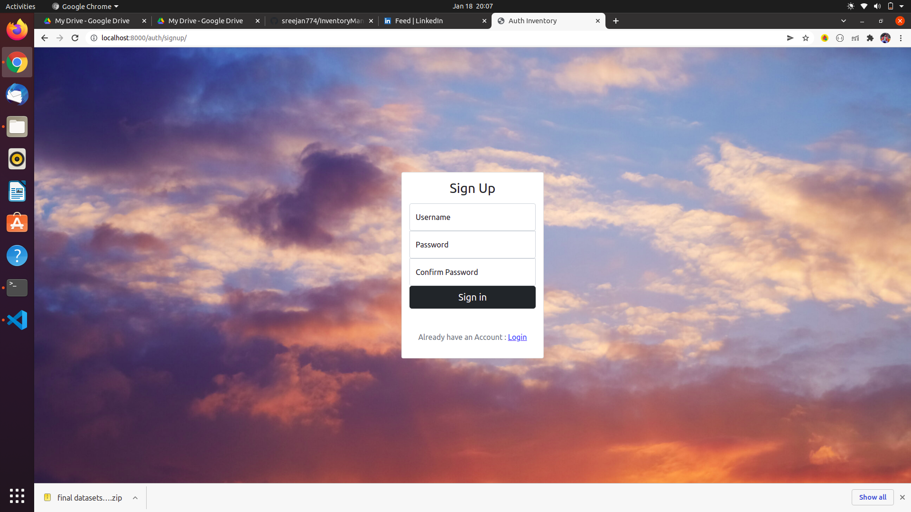
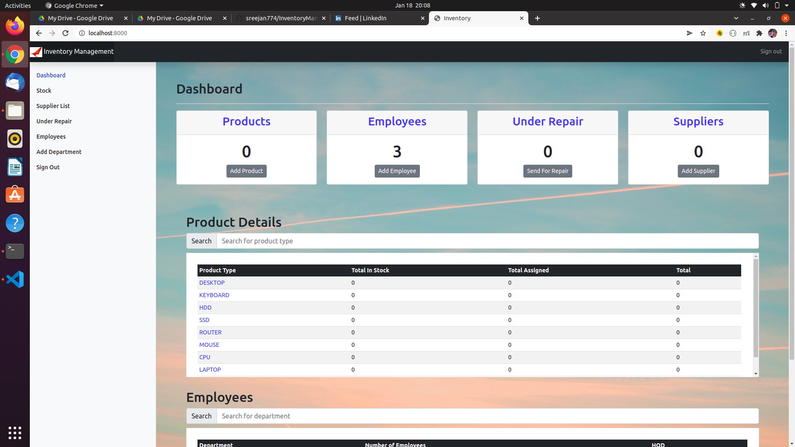
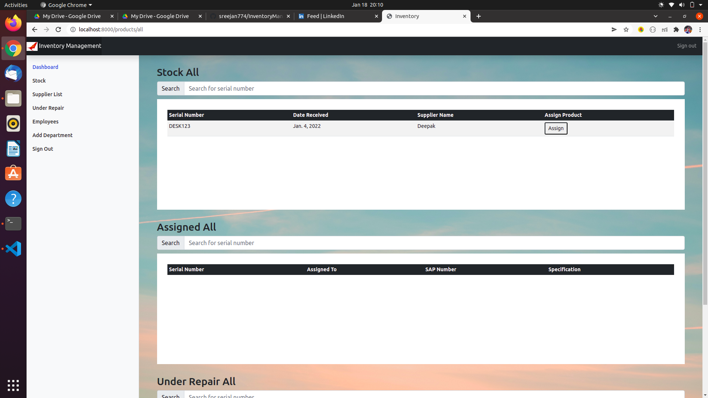
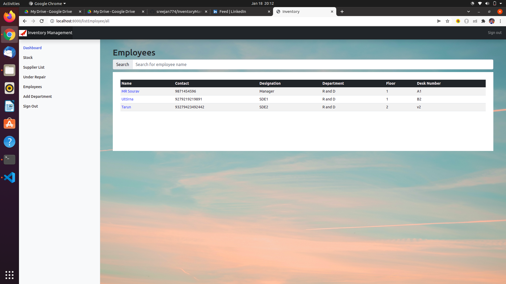

# Covileer
Project for HackOn2.0  
The project aims to provide a platform for supplying delivery assistance to people affected adversely with COVID-19.
The service used in the platform gives non-covid affected people to signup as volunteers and quarantined people as users.
On the platform they can connect with each other and the volunteer can deliver the essential items that user has requested.

### Running Project Locally 
First clone the repository to your local
```bash
git clone https://github.com/sreejan774/Covileer.git
```
Install the requirements:

```bash
pip install -r requirements.txt
```
Collect Static files:

```bash
python manage.py collectstatic
```
Create the database:

```bash
python manage.py migrate
```
Finally, run the development server:

```bash
python manage.py runserver
```
The project will be available at **127.0.0.1:8000**.

## ScreenShots  
Login
---


Signup
---


Homepage
---


Dashboard
---


Employees Details
---
