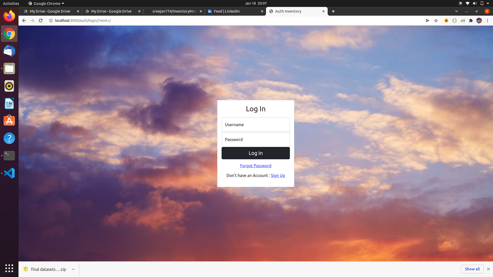

# Inventory Management System
 
The project aims to provide a platform for inventory management for an hypothetical firm. The services this application provides include storing and updating employee details, products details. It also takes care of which all products are assigned to a perticular employee. The other functionalities include storing the suppliers list and manipulating them. Also there is a seperate section for the products that are under repair. 

### Running Project Locally 
First clone the repository to your local
```bash
git clone https://github.com/sreejan774/InventoryManagement.git
```
Install the requirements:

```bash
pip install -r requirements.txt
```
Collect Static files:

```bash
python manage.py collectstatic
```
Create the database:

```bash
python manage.py migrate
```
Finally, run the development server:

```bash
python manage.py runserver
```
The project will be available at **127.0.0.1:8000**.

## ScreenShots  
Login
---


Signup
---


Homepage
---


Dashboard
---


Employees Details
---
